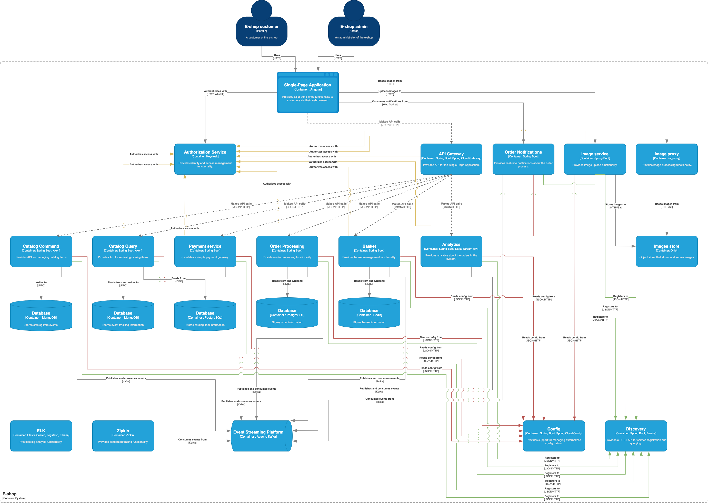
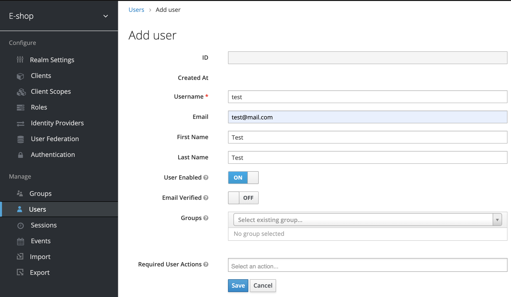
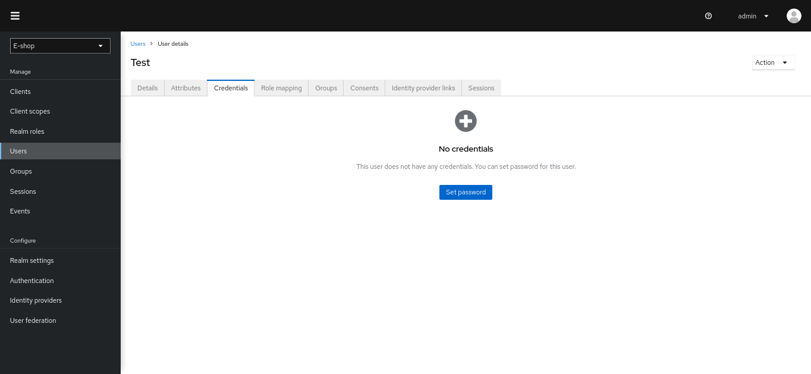
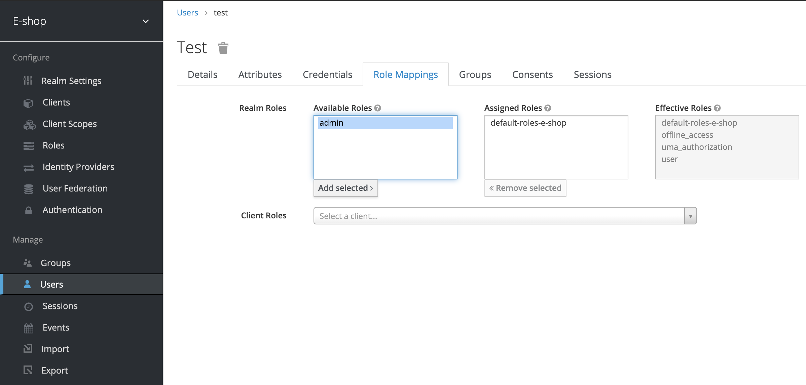

[](https://github.com/hdimitrieski/e-shop/blob/main/LICENSE)

# e-shop

This project is inspired by eShopOnContainers and it's built to demonstrate features of [Spring Cloud](https://spring.io/projects/spring-cloud) for 
implementing microservices architecture. In this project you can find examples of: 
- Spring Cloud Config
- Eureka Service Discovery
- Spring Cloud Gateway
- Spring Cloud Circuit Breaker
- Resilience4j
- Spring Cloud Sleuth
- Spring Cloud Stream
- Spring Kafka
- Kafka Streams API
- Keycloak
- Event Sourcing with Axon
- GraphQL API with Netflix DGS
- Angular
- React and Apollo Client

# Architectural Diagram


# Services
- [Config](infrastructure/config) - Centralized configuration service. You can access this service at 
  http://localhost:8888. Credentials cfguser/cfgpassword.
- [Discovery](infrastructure/discovery) - Service registry that allows other services to find and communicate with each 
  other. You can access this service at http://localhost:8761 and use admin/admin credentials.
- [API Gateway](infrastructure/gateway) - API Gateway. You can access the API Gateway at http://localhost:3000.
- [GraphQL API Gateway](infrastructure/gql-gateway) - GraphQL API Gateway. You can access the GraphQL API Gateway at http://localhost:3001/graphiql.
- [Catalog](services/catalog) - CQRS and Event Sourcing microservice, responsible for managing catalog items.
- [Basket](services/basket) - CRUD data-driven microservice that manages user basket.
- [Order Processing](services/order-processing) - Domain Driven Design (DDD) microservice, responsible for 
  the order process.
- [Order Grace Period Task](services/order-grace-period-task) - Manages order grace period background task.
- [Order Notifications](services/order-notifications) - Notifies the user about the order status in real-time.
- [Payment](services/payment) - Simulates a simple payment gateway.
- [Analytics](services/analytics) - Real-time stream processing with Kafka Streams API.
- [Rating](services/rating) - Simple CQS microservice that manages product ratings.
- [Angular API Gateway Client](clients/ng-rest-client) - Angular client. You can access it at http://localhost:4200.
- [React GraphQL Client](clients/react-graphql-client) - React client. You can access it at http://localhost:4201.

# How To Run
You need to have Gradle 7+, Java 17+, Node.js and Docker. By default, Docker Desktop is set to use 2 GB runtime memory, 
allocated from the total available memory. We recommend setting the runtime memory to 6GB.

The best way to run the services is with IDEs like IntelliJ IDEA or Eclipse. Check their documentation for more details.

## Run Infrastructural Components
Run all infrastructural containers(Postgres, Redis, Kafka, Keycloak authorization service) using the following command:

    ~ cd docker
    ~ docker-compose up

The keystore file on path `docker/keycloak/auth-server.keystore` is generated using the following command: 
```
keytool -genkeypair -alias configkey -keyalg RSA \
  -dname "CN=authorization-service,C=MK,S=OH" \
  -keystore auth-server.keystore -storepass secure-keystore-password
```

Certificate file on path `docker/base/sh/certificate.crt` must be recreate when keystore changed.

## Run micro-services
After you start the infrastructural components, you can run all micro-services using your 
favourite IDE. Check their corresponding documentation.

Keycloak https is enabled, so certificate must be imported before start `micro-services`.
### Import cert
Use `keytool` to import certificate.

On linux like OS, you can excute shell here directly:

    ~ ./docker/base/sh/install-certs.sh

On other OS, you can do it with keytool easy.

## Run micro-services with Docker
If you want to run the services with docker, first build the services with the following command:

    ~ ./gradlew clean build

Then:
1. Run all infrastructure services [Config](infrastructure/config), [Discovery](infrastructure/discovery), 
[API Gateway](infrastructure/gateway) using the following command:


    ~ cd docker
    ~ docker-compose -f docker-compose.infra.yml up --build


2. Run all domain services [Order Processing](services/order-processing), [Catalog](services/catalog),
[Basket](services/basket), [Payment](services/payment), [Order Grace Period Task](services/order-grace-period-task),
[Order Notifications](services/order-notifications), [Analytics](services/analytics), [Rating](services/rating) using the following command:


    ~ cd docker
    ~ docker-compose -f docker-compose.services.yml up --build


## Run imaging service

We use [imgproxy](https://imgproxy.net/) service to resize images on-the-fly. It is a fast and secure standalone server 
for resizing and converting remote images.

All catalog item images are stored in [Minio](https://github.com/minio/minio). Minio is an object storage server. It is 
compatible with Amazon S3, so it can be used with imgproxy.

The images are uploaded to Minio via [Image Service](infrastructure/image-service).

If you don't run these services, the spa client won't be able to fetch catalog item images.

Run imgproxy and Minio services:

    ~ cd docker
    ~ docker-compose -f docker-compose.img.yml up

You can access Minio at http://localhost:8086, and imgproxy at http://localhost:8887.

## ELK (optional)
We use [ELK](https://www.elastic.co/what-is/elk-stack) for log analysis.

Run ELK stack:

    ~ cd docker
    ~ docker-compose -f docker-compose.elk.yml up

Also, you should run all services with 'elk' profile.

## Zipkin (optional)
[Spring Cloud Sleuth](https://spring.io/projects/spring-cloud-sleuth) and [Zipkin](https://zipkin.io/) are used for 
monitoring microservices.

Run Zipkin:

    ~ cd docker
    ~ docker-compose -f docker-compose.zipkin.yml up

To enable distributed tracing, run all services with 'distributed-tracing' profile. 

## Run Angular Client
This client application is implemented with Angular and uses [API Gateway](infrastructure/gateway).

    ~ cd clients/ng-rest-client
    ~ npm install
    ~ npm start

You can access the client application at http://localhost:4200. You can stop some services such as basket, order 
processing, or analytics, and you will notice that you can still use the application without some of its features.

## Run React Client
This client application is implemented with React and uses [GraphQL API Gateway](infrastructure/gql-gateway).

    ~ cd clients/react-graphql-client
    ~ yarn install
    ~ yarn start

You can access the client application at http://localhost:4201.

# Run everything
Alternatively, you can run the system as described bellow.

You can run all docker containers and Spring applications by running the `./scripts/start.sh`. By default, the script
won't start ELK and Zipkin. If you want to use ELK and Zipkin, you can run the script as:
`./scripts/start.sh --elk --distributed-tracing`. To stop everything you can run `./scripts/stop.sh`.

## Create user
Before you start using the application, you need to create a user. You can access Keycloak authorization service at
`http://localhost:8080/auth` Login with admin/admin, go to "Users", click "Add user" and fill in the necessary data.



After you save the user, go to "Credentials" to set a password.



If you want to assign admin role to the user, go to "Role Mappings", select "admin" under "Available Roles" and click
"Add selected".




# Contributing

The [issue tracker](https://github.com/hdimitrieski/e-shop/issues) is the preferred channel for bug reports and features 
requests. If you want to contribute please do not hesitate to submit a pull request.
